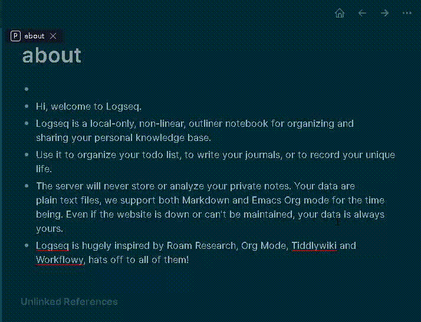

## logseq-translate-plugin

This is a logseq translate plugin. 

### :crossed_swords: Functions
* Select text to show a translate dialog.
* Click more link of the dialog to search selected text at Google Translate.
* You can modify you language in the plugin settnigs file. Apply the settings by reloading the plugin. Reference [languages.js.](https://github.com/matheuss/google-translate-api/blob/master/languages.js) to find the language code/name.

### :film_projector: Demo

### ⚙️Install 

#### Prepare enviroment: Install yarn in Windows
0. Download and install [nodejs](https://nodejs.org/en/).
1. Download nvm-setup.zip at [nvm-windows](https://github.com/coreybutler/nvm-windows/releases).
2. Unzip nvm-setup.zip and install nvm-setup.exe.
3. Download and install [yarn msi](https://yarnpkg.com/latest.msi).

#### Install plugins
* If you can't find this plugin in the marketplaces, do the following steps to get it.
* You will get a folder name as logseq-translate-plugin after clone this repository. `git clone https://github.com/zhihau/logseq-translate-plugin.git`
* Change the directory to logseq-translate-plugin. Right click menu and click `Git bash here`
* Execute command `yarn`.
* Execute command `yarn build`.
* Click the three dot button at the top toolbar. Then click the Settings. Or press `t s` in the page view mode.
* Click Advenced tab.
* Turn on the developer mode.
* Click the three dot button at the top toolbar. Then click the Plugins. Or press `t p` in the page view mode.
* Click `Load unpacked plugin` and select the folder logseq-translate-plugin.
* Turn on this plugin.

### :sparkling_heart: Buy me a coffee 

If the plugin solves your problem, you can buy me a coffee via [this link](https://www.buymeacoffee.com/zhihau).

### License

MIT
